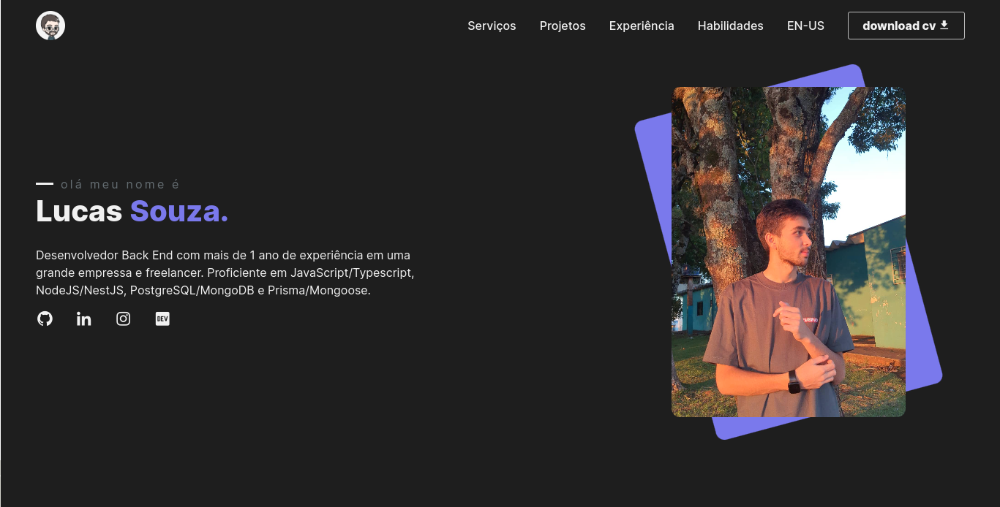

<h1 align="center">
  💻 Meu Portfólio
</h1>

<h4 align="center"><a href="https://portfolio-five-bay-45.vercel.app/">Clique para visitar o projeto</a></h4>

## 📚 Seções

O site é composto por cinco seções:

- **Home:** Nele temos uma breve apresentação dizendo um pouco sobre quem sou;
- **Serviços:** Exibe através de cards os diferentes serviços em que possuo conhecimentos;
- **Projetos:** Apresenta alguns projetos desenvolvidos e com link direto para os respectivos códigos no GitHub;
- **Experiências:** Abordo algumas empresas da qual prestei meus serviços na área de desenvolvimento e ;
- **Habilidades:** Nele apresentamos meus conhecimentos em algumas linguagens com foco no back-end;

---

## 💼 Tecnologias utilizadas

Para o desenvolvimento deste site utilizei as seguintes tecnologias:

- React;
- JavaScript;
- i18
- Vite

---

<h2>🦄 Autor</h2>

<table>
  <tr>
    <td align="center">
      <a href="https://github.com/piazin">
         
        
          <b>Piazin</b>
        
      </a>
    </td>
  </tr>
</table>
